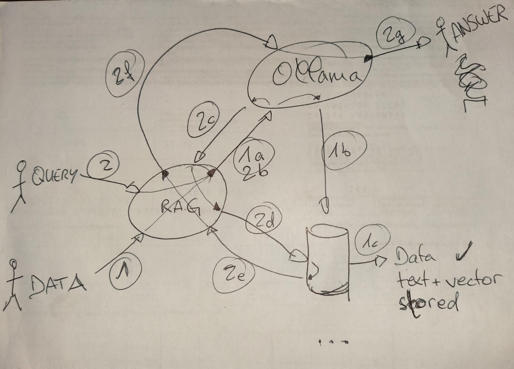

pyairag
=
**POC Python wrapper for RAG on Ollama using Postgres** - nice for experiencing with RAG in the Python REPL.

**TODO**

- [ ] Implement filtering retrieved context data based on *similarity score* gap in `core.contextualize_query()`


Quickstart
-
```sh
docker compose up -d
docker compose run repl
```
See [usage.py](usage.py) for example usage.


Example
-
This example uses models *nomic-embed-text* for embedding (vectorization) and *llama3.2* for querying. It uses the same example dataset shown in [Usage](#usage).

Here was the answer:

> Gates are an integral part of South Korean history and culture, serving as a symbol of royal power, national identity, and architectural significance. Here's an overview of the gates mentioned in the context:
> 
> 1. **Gwanghwamun Gate**: As the main gate of Gyeongbokgung Palace, Gwanghwamun is one of the most iconic gates in Korea. Built in 1395, it is a prime example of traditional Korean architecture and craftsmanship. The gate is adorned with intricate carvings and statues of mythical creatures, showcasing the artistic skills of Korean craftsmen.
> 2. **Dongdaemun Design Plaza (DDP) Gates**: While not a traditional gate, DDP's entrance features two massive steel gates that serve as an imposing entrance to this design hub in Seoul. The gates are designed by architect Zaha Hadid and have become a notable landmark in the city, symbolizing innovation and modernity.
> 3. **Seoul Tower Gates**: The gates surrounding Seoul Tower are not explicitly mentioned, but the tower's base is surrounded by three main entrances that lead to its observation decks. These gates are part of the overall structure designed by architect Noguchi Taro, which integrates seamlessly into the mountainous terrain.
> 
> South Korea has a rich history of gate construction, with many examples found in traditional palaces, temples, and royal districts. Some notable examples include:
> 
> * **Heungbokjeong Gate**: A historic gate in Gyeongbuk Province, known for its unique shape and beautiful garden.
> * **Hyangwonjeong Gate**: Located in the palace grounds of Jongmyo Shrine in Seoul, this gate is famous for its stunning architecture and ornate decorations.
> * **Deokgung Palace Gate**: The main entrance to Deokgung Palace, located on the eastern side of Gyeongbokgung Palace.
> 
> Gates in South Korea often reflect a mix of traditional and modern elements, showcasing the country's rich cultural heritage.


Usage
-
For example in REPL (see [Quickstart](#quickstart)):
```
Python 3.12.5 (main, Aug  6 2024, 19:08:49) [Clang 15.0.0 (clang-1500.3.9.4)] on darwin
Type "help", "copyright", "credits" or "license" for more information.
```
```
>>> import airag.core as rag
```
```
>>> rag.setup()
Pulling models for ollama (takes a while): llama3.2, nomic-embed-text...
{'status': 'success'}
{'status': 'success'}
```
```
>>> rag.import_dummy_data()
Importing dummy data: {'title': 'Seoul Tower', 'content': 'Seoul Tower is a communication and observation tower located on Namsan Mountain in central Seoul, South Korea.'}
Importing dummy data: {'title': 'Gwanghwamun Gate', 'content': 'Gwanghwamun is the main and largest gate of Gyeongbokgung Palace, in Jongno-gu, Seoul, South Korea.'}
Importing dummy data: {'title': 'Bukchon Hanok Village', 'content': 'Bukchon Hanok Village is a Korean traditional village in Seoul with a long history.'}
Importing dummy data: {'title': 'Myeong-dong Shopping Street', 'content': 'Myeong-dong is one of the primary shopping districts in Seoul, South Korea.'}
Importing dummy data: {'title': 'Dongdaemun Design Plaza', 'content': 'The Dongdaemun Design Plaza is a major urban development landmark in Seoul, South Korea.'}
```
```
>>> rag.show()
Title: Seoul Tower, Content: Seoul Tower is a communication and observation tower located on Namsan Mountain in central Seoul, South Korea., Embedding Dimensions: 768
Title: Gwanghwamun Gate, Content: Gwanghwamun is the main and largest gate of Gyeongbokgung Palace, in Jongno-gu, Seoul, South Korea., Embedding Dimensions: 768
Title: Bukchon Hanok Village, Content: Bukchon Hanok Village is a Korean traditional village in Seoul with a long history., Embedding Dimensions: 768
Title: Myeong-dong Shopping Street, Content: Myeong-dong is one of the primary shopping districts in Seoul, South Korea., Embedding Dimensions: 768
Title: Dongdaemun Design Plaza, Content: The Dongdaemun Design Plaza is a major urban development landmark in Seoul, South Korea., Embedding Dimensions: 768
```
```
>>> query = 'Tell me about gates in South Korea.'
>>> response = rag.query(query)
Retrieving context data...
0.703527377977401: Gwanghwamun Gate
0.5820260204122369: Dongdaemun Design Plaza
0.5514574140411692: Seoul Tower
Querying model "llama3.2" with context:
> Query: Tell me about gates in South Korea.
> 
> Context:
> 
> Title: Gwanghwamun Gate
> Content: Gwanghwamun is the main and largest gate of Gyeongbokgung Palace, in Jongno-gu, Seoul, South Korea.
> 
> Title: Dongdaemun Design Plaza
> Content: The Dongdaemun Design Plaza is a major urban development landmark in Seoul, South Korea.
> 
> Title: Seoul Tower
> Content: Seoul Tower is a communication and observation tower located on Namsan Mountain in central Seoul, South Korea.
```
```
>>> print(response)
In South Korea, gates are an integral part of the country's rich history and architecture. Here are some interesting facts about gates in South Korea:

1. Traditional Gates: In traditional Korean architecture, gates were not only functional but also served as symbols of power and authority. They were often adorned with intricate carvings, sculptures, and calligraphy, showcasing the wealth and prestige of the ruling family.
2. Gyeongbokgung Palace Gate: The Gwanghwamun Gate, located at Gyeongbokgung Palace in Seoul, is one of the most iconic gates in South Korea. Built in 1395, it is a masterpiece of traditional Korean architecture and a testament to the country's rich cultural heritage.
3. Modern Gates: In modern times, gates have evolved to serve new purposes. The Dongdaemun Design Plaza in Seoul is an excellent example of this transformation. This futuristic structure, completed in 2010, features a striking gate-like entrance that has become a symbol of Seoul's design and fashion scene.
4. Symbolic Gates: In South Korean culture, gates are often associated with good luck, prosperity, and new beginnings. The Seoul Tower, built on Namsan Mountain in central Seoul, features a distinctive gate at its base, which is believed to bring good fortune to those who pass under it.
5. Heritage Gates: Many historic gates in South Korea have been designated as national cultural assets or UNESCO World Heritage Sites. These gates not only preserve the country's architectural heritage but also serve as a reminder of the nation's rich history and cultural identity.

Some notable gates in South Korea include:

* Gwanghwamun Gate (Gyeongbokgung Palace)
* Dongdaemun Design Plaza
* Seoul Tower (Namsan Mountain)
* Heoinsa gate (Han River)
* Deoksugung Palace Gate

These gates not only showcase the country's architectural heritage but also reflect the values of Korean culture, including respect for tradition, innovation, and community.
```


Workflow
-


1. Insert one item of private data
    - 1a - Vectorize data (embedding)
    - 1b - Store data and vector in DB
    - Note: As NOT shown on the diagram, Ollama generates the vector and RAG stores the vector in DB

2. Query using private data
   - 2b - Vectorize query (embedding)
   - 2d - Query private data DB using vector similarity (between query and stored data vectors)
   - 2f - Add relevant context to the query and perform query
   - 2g - Answer generated


Sources
-
This experiment is taken from:
- https://www.timescale.com/blog/build-a-fully-local-rag-app-with-postgresql-mistral-and-ollama/
- https://github.com/timescale/private-rag-example/